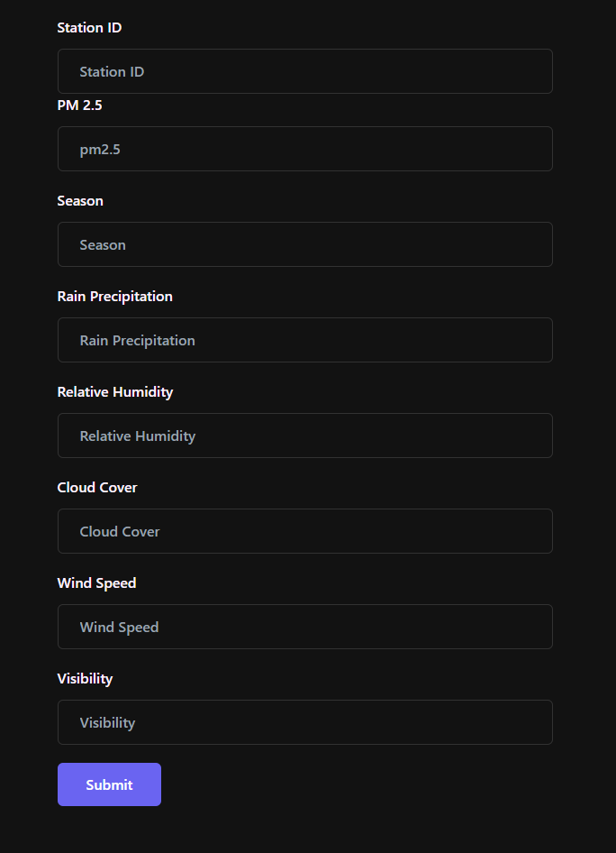

# CSE303-sec-03-Group-03

## Application - Weather Monitoring App
Welcome to the CSE303 Weather Monitoring Application! This project was developed as part of the Database Management (CSE303) course. It is a full-stack web application that allows users to monitor weather data collected from weather stations and government facilities.

### Objectives 
The main objective of this project is to provide a comprehensive weather monitoring solution. The application facilitates the input of weather data through an intuitive input form, which is accessible to weather stations and government facilities. The collected data is then stored and managed using a MySQL database. The application serves as a valuable resource for decision makers, weather monitoring facilities, and the general public.

### Features
* User-friendly interface: The front-end of the application is built using HTML, CSS, and JavaScript, providing an intuitive and visually appealing user interface.
* Powerful backend: The backend of the application is developed using Django, a high-level Python web framework. Django provides robust features for handling data management and processing.
* Secure database management: The application utilizes MySQL as the database management system. MySQL offers reliability, scalability, and strong data security.
* Weather data input form: The application provides an input form for weather stations and government facilities to input the collected weather data. The form ensures accurate and standardized data entry.
* Data visualization: The collected weather data can be visualized using graphs and charts, allowing users to analyze trends and patterns over time.
* Access for decision makers: Decision makers can access the application to view and analyze the weather data. This information can aid in making informed decisions related to various sectors affected by weather conditions.
* Access for the general public: The application also caters to the general public by providing weather updates and forecasts. Users can access the latest weather information in their area through the application.

 as yyyy,avg(pm25) as pm from location as l inner join weather_info as w using(locID) group by year(daily).png)

### Contributors

1.	S. M. A Sayed Al Banna @zorojuro75
2.	Injamam Ul Haque @injamam00155
3.	Akib Raihan  @Akib-RaihanPop
4.	Anannya Preeta @pretzel2001
5.	Syed Niaz Mohtasim @syedniaz
